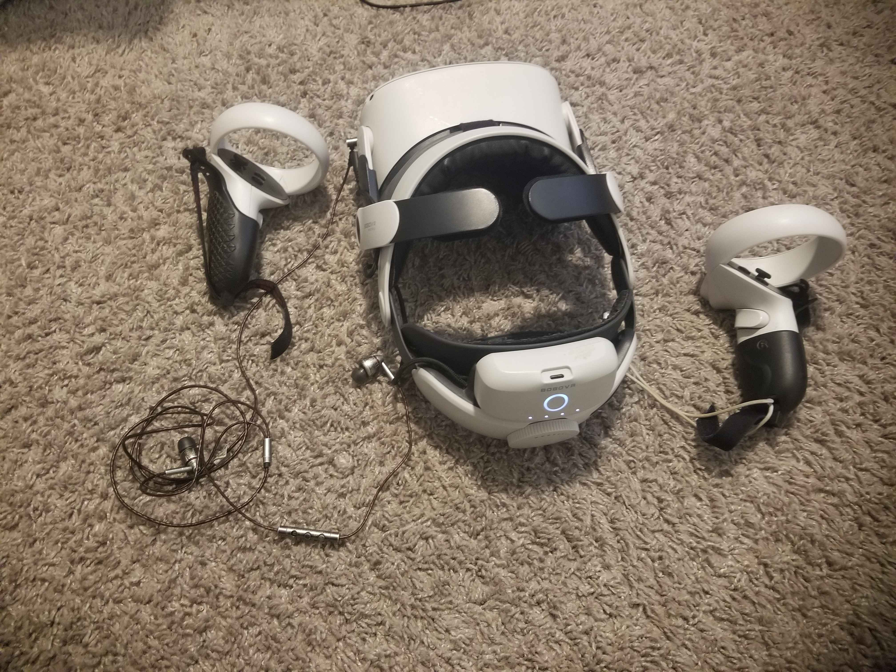
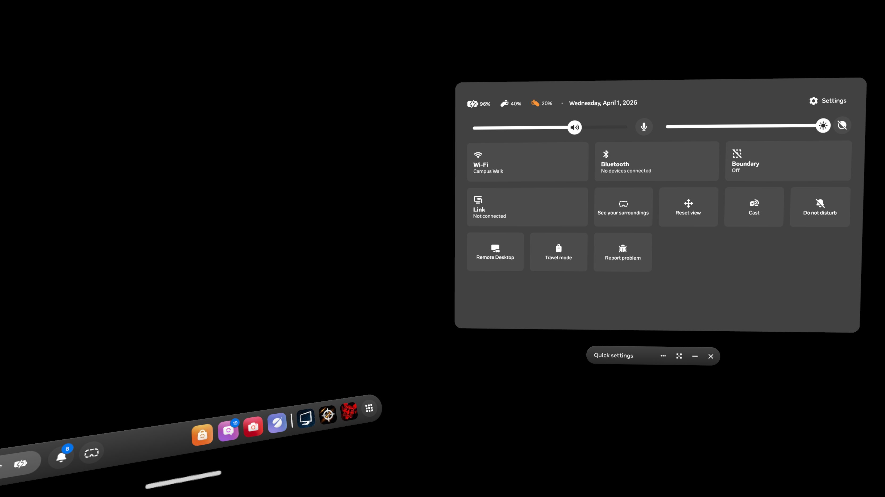
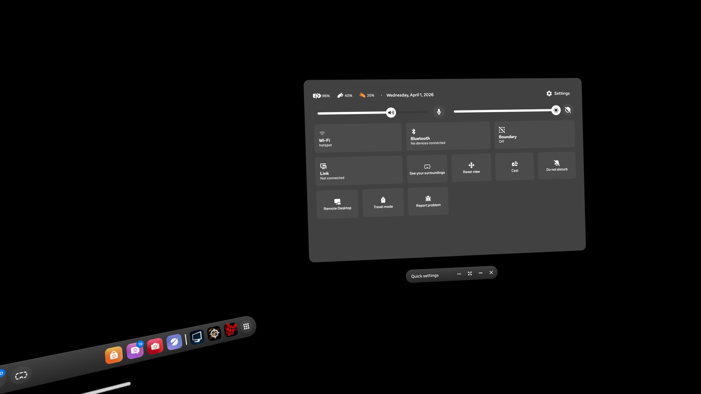
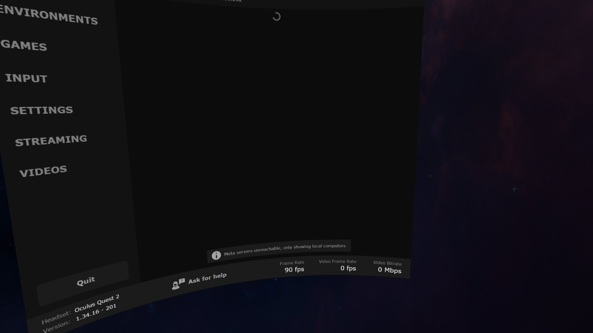
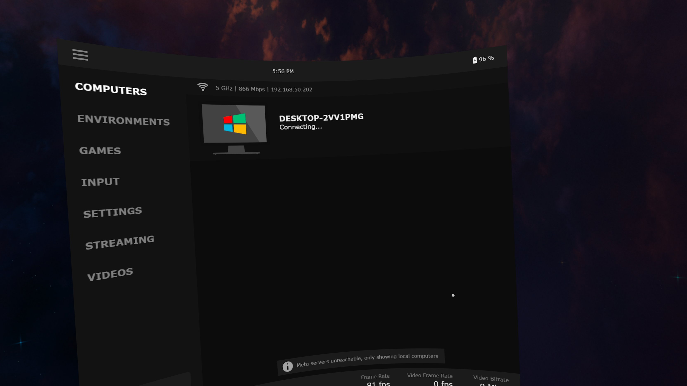
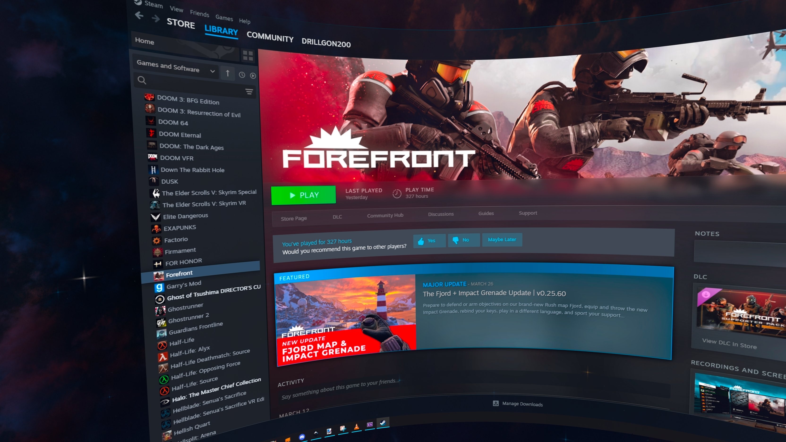
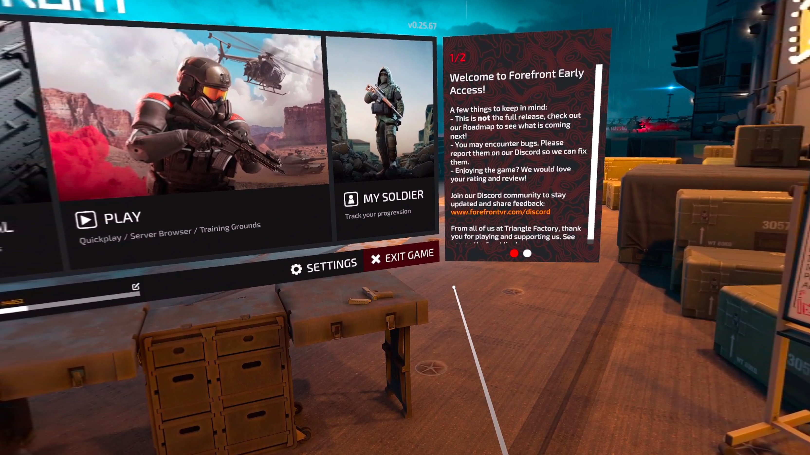
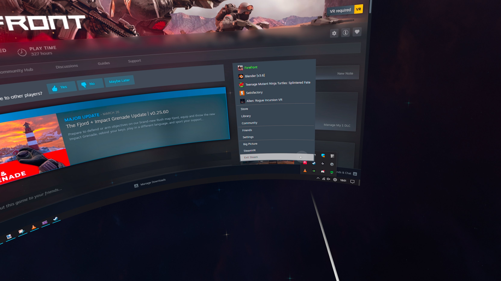
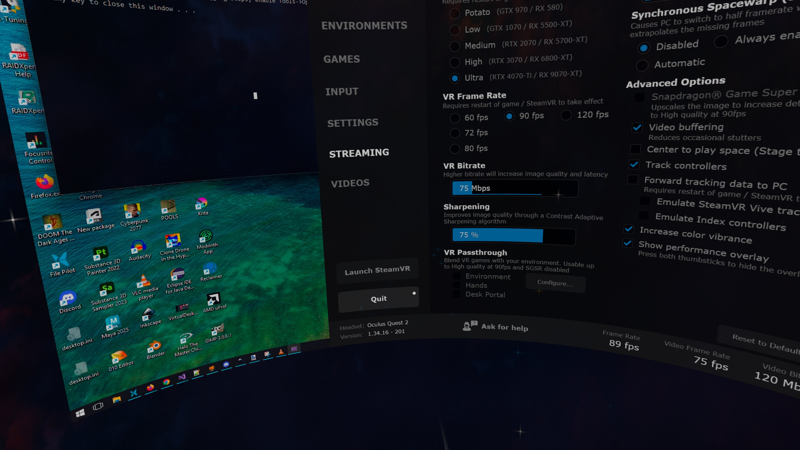

# Starting and Ending a PC VR Game from a Quest 2

One of the most annoying things about playing VR games is the setup and teardown process. Simply getting to a game's menu screen is an ordeal that is often full of bugs and other issues, and often takes several minutes. This is in stark contrast to starting a non VR game, which is usually as simple as double clicking the game icon.

My goal in this is very simple: get to the main menu of a VR game running on my PC, then close the game and disconnect from my PC.

## Interaction

1. I unplug the Quest 2 from its charging cable, then attach the external battery charging cable and magnetically snap on a charged external battery. This battery serves a dual purpose, acting as both a charge boost and a counterweight for the heavy front of the headset.
2. I plug in earbuds and press the power button

3. The Quest 2 has shut down since I last used it despite me never telling it to, so I long press the power button and wait for the logo to come up.
4. After it boots, I select my account. The home UI slowly loads in, but the virtual background does not, leaving me looking at a greyscale version of my room. No matter, I don't need a virtual background to start my games.

5. I see that, despite having last been connected to the local network I set up specifically for PC VR streaming, the device has now connected to my apartment building's WiFi instead. I click on the Wi-Fi button to change this. This does not match my **mental model** for how this should work, which is for it to reconnect to the last network it was connected to on startup.

6. I'm able to change to my local network. I then click the virtual desktop icon to launch the program I use to connect to my PC.

7. Virtual desktop takes a long time, 10-20 seconds, to find my PC if it doesn't have internet access. At the end of this, it simply says "Entitlement Check Failed". I'm not sure what this means, but from previous experience I know that I have to restart virtual desktop while connected to the internet, then close it and connect back to my local network, then open it again. I do this. After the 10-20 second wait again, it shows my PC.

8. I try to connect to it. It instantly disconnects me the first time, so I try it again and it works this time. The disconnection violates the **feedback principle**, as it doesn't have any indication as to what went wrong, if anything.
9. I open the settings menu to check if I have a good connection bitrate. I don't, it's locked at 45 Mbps, not enough for a good VR experience. I know from experience that this means something went wrong with Windows' network software, so I unplug and replug my PC's ethernet cable to restart it. After that, I restart virtual desktop and connect again. I'm now getting a good bitrate.

10. I can now start Steam, which takes 10-20 seconds, then start my game. The game takes 10-20 seconds to load.

11. Success! I've now loaded into my game.

12. To close it, I click the "Exit Game" button. This successfully shuts down the game.

13. Steam doesn't detect this shutdown and thinks the game is still open. This means I have to close Steam so it doesn't think I'm playing a game when I'm not. Closing Steam also takes several seconds.

14. After Steam is closed, I open the virtual desktop menu with my left controller and click "Quit". This works, sending me back to the Quest home screen.
15. I put down the Quest 2 and plug it into a charging cable.

## Outcome
While I did eventually get to the main menu of a game, it was a painful process with many bugs and workarounds that I only know because I've experimented enough to find them. The whole thing took around 10 minutes, which is a very long time if you just want to enjoy something after work/school or friends are waiting for you in a multiplayer lobby. This process applies significant **cognitive load**, as I have to think about and remember how to work around all of these issues instead of focusing on the game I'm about to play.

Instead of this large list of steps, what I really want is for my headset to always be connected to my PC, or at least for the connection to be instant and automatic. Instead of starting up my headset, selecting the right internet, starting virtual desktop, and waiting for it to find my PC so I can connect, I want to pick up my headset and have it be automatically connected in under 1 second. Steam should also start in under 1 second so that I can quickly start the game I want. This would minimize the huge amount of friction currently present for this task.
